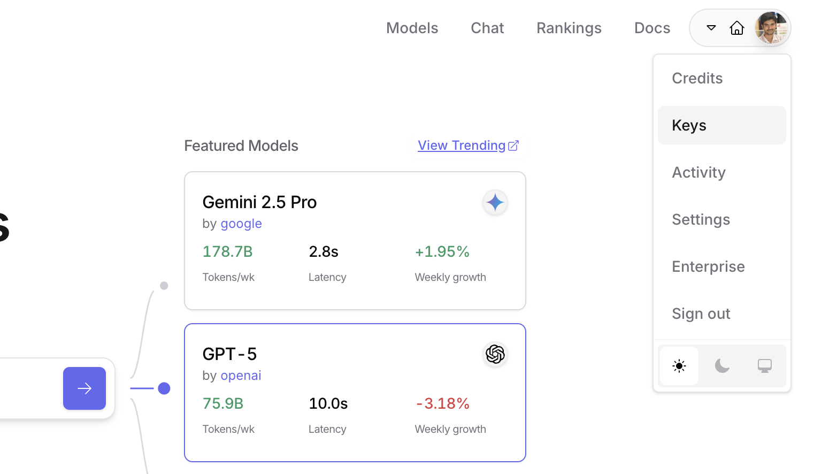
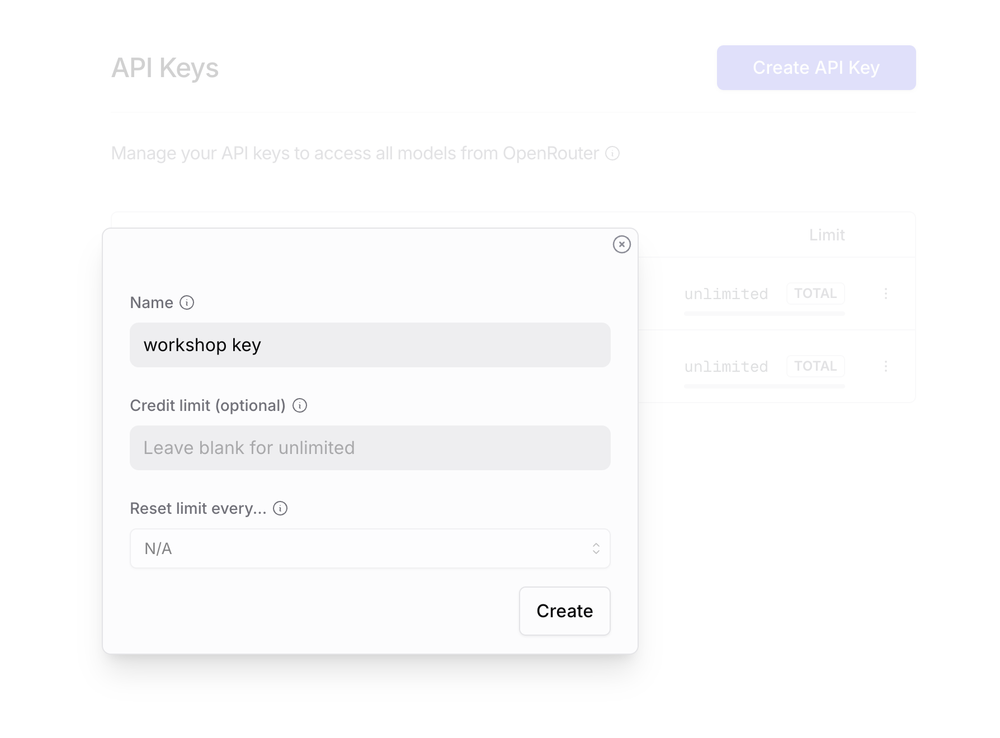
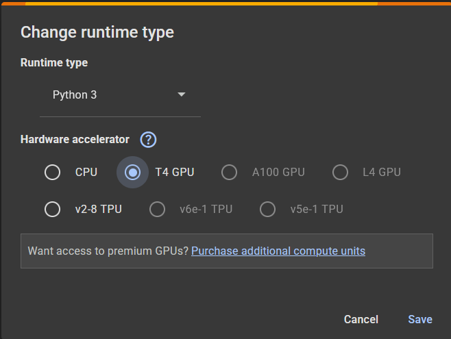
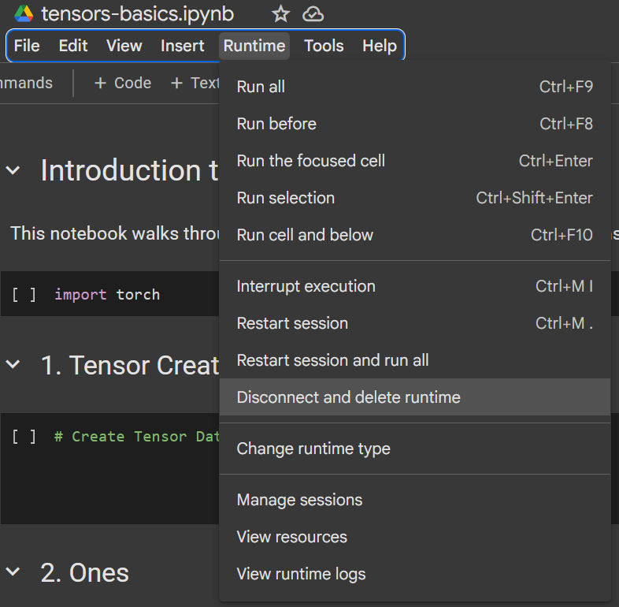

# prompt2finetune
Practical AI: From Prompting to Fine-Tuning

### Prerequirstics
- Setup the colab

  - Logon to 

- Setup openrouter (to play with AI)

  - Logon to <a href="https://openrouter.ai/" target="_blank">https://openrouter.ai/</a>
  
  - click on the profile icon and click on the `key` menu
  
  
  - click on the `create new key` button and fill up the name and leave the next fields blank and click on create. Copy the key and paste it in the any notepad
  

  - Goto  and click on the `key` icon on the left menu.
  

  - Click on the `Add New Secret`.

  - Give Secret `Name` as `OPENAI_API_KEY` and set `Value` to the key we have created in openrouter.

  - Turn on the `Note Book Access` toggle to allow this secret to consume in the colab notebooks.

### Prompting Strategies

### RAG Implementation

### MCP Implementation

### Finetuning:
- Open this colab 

- Click on Connect and `Select Change runtime type`

- Choose Select `Runtime Type` - Python and `Hardware accelerator` - T4 GPU, and click Save

- Play with colab

- Delete the runtime
